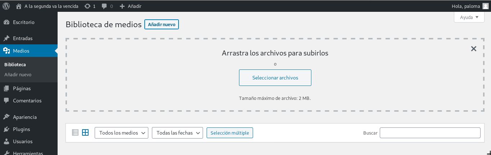
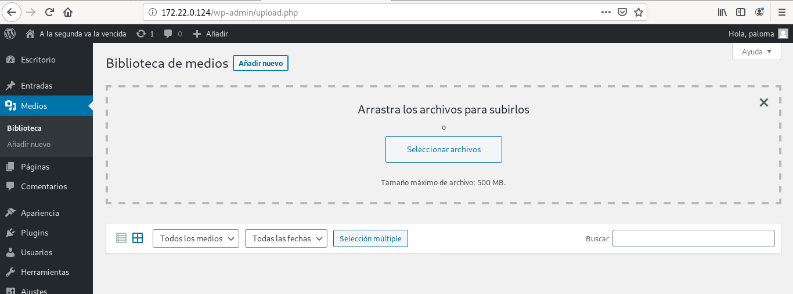
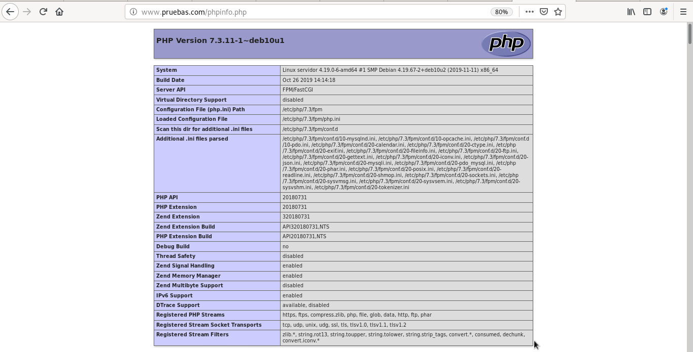
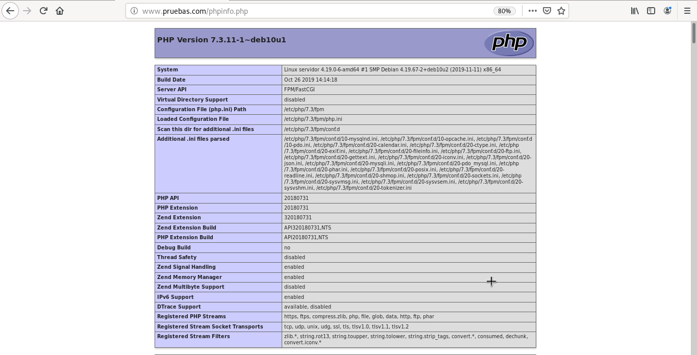
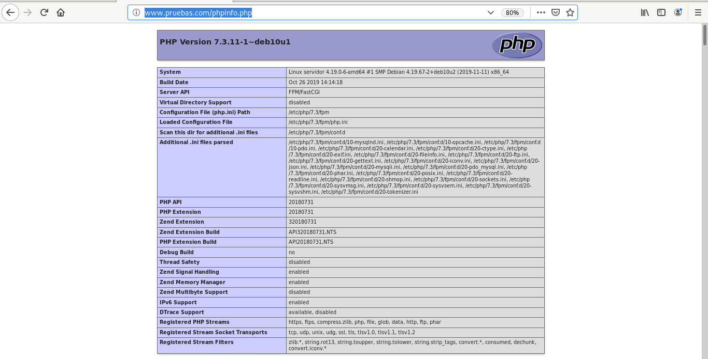

# Práctica: Ejecución de scripts PHP y Python. Rendimiento

### Ejecución de scripts PHP
Vamos a comparar el rendimiento de distintas configuraciones de servidores web sirviendo páginas dinámicas programadas con PHP, en concreto vamos a servir un CMS Wordpress.

Las configuraciones que vamos a realizar son las siguientes:
- Módulo php5-apache2
- PHP-FPM (socket unix) + apache2
- PHP-FPM (socket TCP) + apache2
- PHP-FPM (socket unix) + nginx
- PHP-FPM (socket TCP) + nginx

#### Apache2
**Tarea 1: Realiza las configuraciones indicadas anteriormente y muestra una comprobación (con phpinfo()) donde se vea la configuración actual.**
- Explica brevemente la modificación en los ficheros de configuración para cada una de las opciones.
- En cada una de las configuraciones debe funcionar el CMS WordPress.
- Cuando accedes a la biblioteca de medios de WordPress para subir una imagen, vemos que el tamaño máximo es 512Mb.
- Modifica la configuración de PHP en cada caso para aumentar el tamaño de los ficheros que podemos subir.

### Módulo php7-apache2
Se instala php y el módulo php de Apache2, en este caso no se instala el servidor web Apache, porque ya está instalado en esta máquina. Si no estuviese habría que instalar el paquete apache2.
~~~
vagrant@servidor:~$ sudo apt install php7.3 libapache2-mod-php7.3
~~~

Configuración del fichero **/var/www/html/phpinfo.php** con la configuración:
~~~
<?php

// Show all information, defaults to INFO_ALL
phpinfo();

?>
~~~

**Intalación de un CMS**
Se va a instalar Wordpress siguiendo [estos pasos](https://github.com/PalomaR88/Instalacion_aplicaciones_web/blob/master/Practica-aplicaciones.md#creaci%C3%B3n-de-sitio-wordpress).

> Son necesarios tener instalado un gestor de bases de datos y el módulo para que php pueda funcionar con dicho gestor. Ambas cosas se instalan:
~~~
vagrant@servidor:~$ sudo apt install mariadb-server
vagrant@servidor:~$ sudo apt install php-mysql 
~~~

**Modficación de Wordpress**
Se va a modificiar el tamaño máximo de archivos de la biblioteca de medios de Wordpress.

Para modificar estos parámetros se editan los siguientes parámetros de **/etc/php/7.3/apache2/php.ini**:
~~~
...
post_max_size = 800M
...
upload_max_filesize = 500M
...
~~~

### PHP-FPM (socket unix) + apache2
Se cambia el propietari del root:
~~~
vagrant@servidor:~$ sudo chown -R www-data:www-data /var/www/html/wordpress/
~~~

Se instalan los paquetes de php:
~~~
vagrant@servidor:~$ sudo apt install php7.3-fpm php-common
~~~

Se modifica el fichero **/etc/php/7.3/fpm/pool.d/www.conf** con la siguiente ruta en el parámetro listen:
~~~
listen = /run/php/php7.3-fpm.sock
~~~

Se reinicia php:
~~~
vagrant@servidor:~$ sudo systemctl restart php7.3-fpm.service 
~~~

Y se desactiva el módulo que se tenía antes:
~~~
vagrant@servidor:~$ sudo a2dismod php7.3
Module php7.3 disabled.
To activate the new configuration, you need to run:
  systemctl restart apache2
~~~

Y se activa el nuevo módulo setenvif:
~~~
vagrant@servidor:~$ sudo a2enmod proxy_fcgi setenvif
Considering dependency proxy for proxy_fcgi:
Enabling module proxy.
Enabling module proxy_fcgi.
Module setenvif already enabled
To activate the new configuration, you need to run:
  systemctl restart apache2
vagrant@servidor:~$ sudo systemctl restart apache2.service 
~~~

Se añaden las sigueintes líneas configurando php en **/etc/apache/sites-available/000-default.conf**:
~~~
	<FilesMatch "\.php$">
		SetHandler "proxy:unix:/run/php/php7.3-fpm.sock|fcgi://127.0.0.1/"
	</FilesMatch>
~~~

Y se añade la configuración correspondiente a **/etc/apache2/conf-available/php7.3-fpm.conf**:
~~~
        SetHandler "proxy:unix:/run/php/php7.3-fpm.sock|fcgi://localhost"
~~~

Se añade la nueva configuración:
~~~
vagrant@servidor:~$ sudo a2enconf php7.3-fpm
Enabling conf php7.3-fpm.
To activate the new configuration, you need to run:
  systemctl reload apache2
vagrant@servidor:~$ sudo systemctl reload apache2
~~~

Y se reinicia el servicio de php:
~~~
vagrant@servidor:~$ sudo systemctl restart php7.3-fpm.service 
~~~

**Modficación de Wordpress**

De nuevo se va a modificar la capacidad de tamaño de los ficheros que pueden ser subidos.

Se modifican los mismos parámetros que en el punto anterior, pero esta vez del fichero **/etc/php/7.3/fpm/php.ini**.

### PHP-FPM (socket TCP) + apache2

Fichero **phpinfo.php** con la configuración:

Configuración de **/etc/php/7.3/fpm/pool.d/www.conf**:
~~~
listen = 127.0.0.1:9000
~~~

Configuración de **/etc/apache2/sites-available/000-default.conf**:
~~~
        ProxyPassMatch ^/(.*\.php)$ fcgi://127.0.0.1:9000/var/www/html/wordpress
~~~

Configuración de **/etc/apache2/conf-available/php7.3-fpm.conf**:
~~~
        SetHandler "proxy:fcgi://127.0.0.1:9000"
~~~

Se añade la nueva configuración:
~~~
vagrant@servidor:~$ sudo a2enconf php7.3-fpm
Enabling conf php7.3-fpm.
To activate the new configuration, you need to run:
  systemctl reload apache2
vagrant@servidor:~$ sudo systemctl reload apache2
~~~

Y se reinicia el servicio de php:
~~~
vagrant@servidor:~$ sudo systemctl restart php7.3-fpm.service 
~~~

**Modficación de Wordpress**
Se modifica la capacidad de tamaño de los ficheros que pueden ser subidos, como anteriormente.

### PHP-FPM (socket TCP) + nginx

Fichero **phpinfo.php** con la configuración:

Se para el servicio de apache2:
~~~
vagrant@servidor:~$ sudo systemctl stop apache2.service
~~~

Se instala nginx:
~~~
vagrant@servidor:~$ sudo apt install nginx
~~~

Se crea el documentroot:
~~~
vagrant@servidor:~$ sudo nano /etc/nginx/conf.d/default.conf
~~~

Fichero default.conf:
~~~
server {
	listen 80 default_server;
	listen [::]:80 default_server;

	root /var/www/html;
	index index.html index.htm index.nginx-debian.html;

	server_name www.pruebas.com;

	location / {
		try_files $uri $uri/ =404;
	}

	location ~ \.php$ {
		include snippets/fastcgi-php.conf;
	
	#	fastcgi_pass unix:/run/php/php7.3-fpm.sock;
		fastcgi_pass 127.0.0.1:9000;
	}
}
~~~

Configuración de **/etc/php/7.3/fpm/pool.d/www.conf**:
~~~
listen = 127.0.0.1:9000
~~~

Configuración de **/etc/apache2/conf-available/php7.3-fpm.conf**:
~~~
        SetHandler "proxy:fcgi://127.0.0.1:9000"
~~~

Se reinician los servicios:
~~~
vagrant@servidor:~$ sudo systemctl restart nginx
vagrant@servidor:~$ sudo systemctl restart php7.3-fpm.service
~~~

**Modficación de Wordpress**
Se modifica la capacidad de tamaño de los ficheros que pueden ser subidos, como anteriormente.

### PHP-FPM (socket UNIX) + nginx

Fichero **phpinfo.php** con la configuración:

Se modifica el fichero default.conf del documentroot:
~~~
server {
	listen 80 default_server;
	listen [::]:80 default_server;

	root /var/www/html;
	index index.html index.htm index.nginx-debian.html;

	server_name www.pruebas.com;

	location / {
		try_files $uri $uri/ =404;
	}

	location ~ \.php$ {
		include snippets/fastcgi-php.conf;
	
		fastcgi_pass unix:/run/php/php7.3-fpm.sock;
	#	fastcgi_pass 127.0.0.1:9000;
	}
}
~~~

Configuración de **/etc/php/7.3/fpm/pool.d/www.conf**:
~~~
listen = /run/php/php7.3-fpm.sock
~~~

Configuración de **/etc/apache2/conf-available/php7.3-fpm.conf**:
~~~
          SetHandler "proxy:unix:/run/php/php7.3-fpm.sock|fcgi://localhost"
~~~

Se reinician los servicios:
~~~
vagrant@servidor:~$ sudo systemctl restart nginx
vagrant@servidor:~$ sudo systemctl restart php7.3-fpm.service
~~~

**Modficación de Wordpress**
Se modifica la capacidad de tamaño de los ficheros que pueden ser subidos, como anteriormente.

#### Redimiento
Después de hacer varias pruebas de rendimiento con un número variable de peticiones concurrentes (1, 10, 25, 50, 75, 100, 250, 500, 1000). Los resultados obtenidos son los siguientes:

Podemos determinar que la opción que nos ofrece más rendimiento es nginx + fpm_php (socket unix).

A partir de esa configuración vamos a intentar aumentar el rendimiento de nuestro servidor.

##### Prueba de rendimiento - Módulo php7-apache2
Para realizar las peubas de rendimiento hay que descargar los siguientes paquetes:
~~~
paloma@coatlicue:~/DISCO2/CICLO II/SERVICIO DE RED E INTERNET/Apache2_y_modulo_php$ sudo apt install apache2-utils
~~~

Se introduce el siguiente comando 5 veces, reiniciando el servicio cada vez que se introduce, para ver el rendimiento:
~~~
paloma@coatlicue:~$ ab -t 10 -c 200 -k http://172.22.8.1/index.php
~~~

Y de las respuestas, esta es la información que nos interesa:
~~~
Requests per second:    24.86 [#/sec] (mean)
Requests per second:    27.57 [#/sec] (mean)
Requests per second:    25.85 [#/sec] (mean)
Requests per second:    24.29 [#/sec] (mean)
Requests per second:    24.04 [#/sec] (mean)
~~~

Media: 25.322

##### Prueba de rendimiento - PHP-FPM (socket UNIX) + apache2
Comando:
~~~
paloma@coatlicue:~$ ab -t 10 -c 200 -k http://172.22.0.124/index.php
~~~

Resultados:
~~~
Requests per second:    42.27 [#/sec] (mean)
Requests per second:    38.20 [#/sec] (mean)
Requests per second:    37.38 [#/sec] (mean)
Requests per second:    32.98 [#/sec] (mean)
Requests per second:    44.80 [#/sec] (mean)
~~~

Media: 39.126

##### Prueba de rendimiento - PHP-FPM (socket TCP) + apache2
Comando:
~~~
paloma@coatlicue:~$ ab -t 10 -c 200 -k http://172.22.0.124/index.php
~~~

Resultados:
~~~
Requests per second:    41.70 [#/sec] (mean)
Requests per second:    49.18 [#/sec] (mean)
Requests per second:    35.28 [#/sec] (mean)
Requests per second:    37.40 [#/sec] (mean)
Requests per second:    26.23 [#/sec] (mean)
~~~

Media: 37.958

##### Prueba de rendimiento - PHP-FPM (socket TCP) + nginx
Comando:
~~~
paloma@coatlicue:~$ ab -t 10 -c 200 -k http://172.22.0.124/index.php
~~~

Resultados:
~~~
Requests per second:    46.14 [#/sec] (mean)
Requests per second:    47.15 [#/sec] (mean)
Requests per second:    47.61 [#/sec] (mean)
Requests per second:    47.02 [#/sec] (mean)
Requests per second:    45.47 [#/sec] (mean)
~~~

Media: 46.678

##### Prueba de rendimiento - PHP-FPM (socket UNIX) + nginx
Comando:
~~~
paloma@coatlicue:~$ ab -t 10 -c 200 -k http://172.22.0.124/index.php
~~~

Resultados:
~~~
Requests per second:    1662.47 [#/sec] (mean)
Requests per second:    1602.04 [#/sec] (mean)
Requests per second:    1525.08 [#/sec] (mean)
Requests per second:    1399.60 [#/sec] (mean)
Requests per second:    1621.99 [#/sec] (mean)
~~~

Media: 1562.236

#### Aumento de rendimiento en la ejecución de scripts PHP
**Tarea 2: Añade a la configuración ganadora del punto anterior memcached. Documenta la instalación y configuración memcached. Recuerda que para que Wordpress utilice memcached le tenemos que instalar un plugin. Muestra las estadísticas de memcached después de acceder varias veces a wordpress para comprobar que esa funcionando.**

**Tarea 3: Configura un proxy inverso - caché Varnish escuchando en el puerto 80 y que se comunica con el servidor web por el puerto 8080. Entrega y muestra una comprobación de que varnish está funcionando con la nueva configuración.**

#### Rendimiento
Veamos las tres opciones que hemos configurado y veamos los resultados después del estudio de rendimiento:

Podemos observar como el uso de varnishd aumenta muy significativamente el rendimiento de nuestro servidor.

