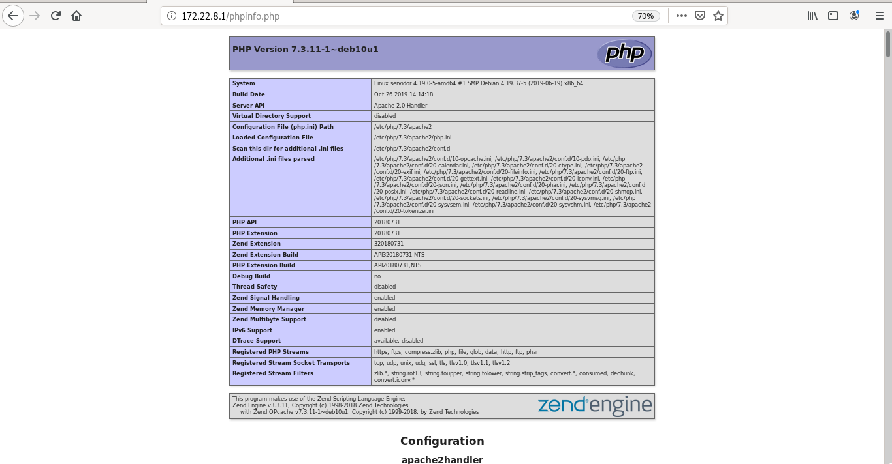
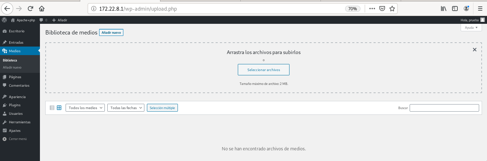
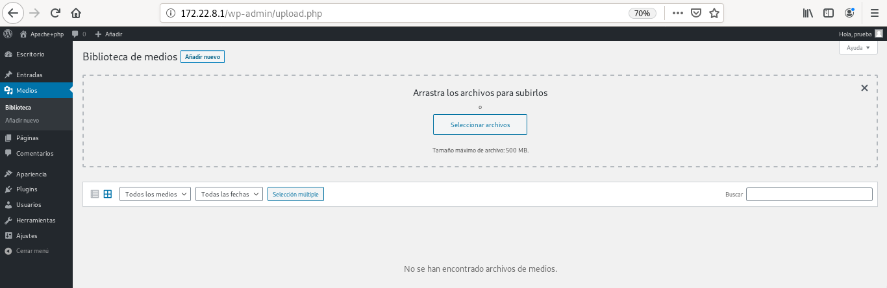

# Práctica: Ejecución de scripts PHP y Python. Rendimiento

### Ejecución de scripts PHP
Vamos a comparar el rendimiento de distintas configuraciones de servidores web sirviendo páginas dinámicas programadas con PHP, en concreto vamos a servir un CMS Wordpress.

Las configuraciones que vamos a realizar son las siguientes:
- Módulo php5-apache2
- PHP-FPM (socket unix) + apache2
- PHP-FPM (socket TCP) + apache2
- PHP-FPM (socket unix) + nginx
- PHP-FPM (socket TCP) + nginx

#### Apache2
**Tarea 1: Realiza las configuraciones indicadas anteriormente y muestra una comprobación (con phpinfo()) donde se vea la configuración actual.**
- Explica brevemente la modificación en los ficheros de configuración para cada una de las opciones.
- En cada una de las configuraciones debe funcionar el CMS WordPress.
- Cuando accedes a la biblioteca de medios de WordPress para subir una imagen, vemos que el tamaño máximo es 512Mb.
- Modifica la configuración de PHP en cada caso para aumentar el tamaño de los ficheros que podemos subir.

##### Módulo php7-apache2
Se instala php y el módulo php de Apache2, en este caso no se instala el servidor web Apache, porque ya está instalado en esta máquina. Si no estuviese habría que instalar el paquete apache2.
~~~
vagrant@servidor:~$ sudo apt install php7.3 libapache2-mod-php7.3
~~~

Configuración del fichero **/var/www/html/phpinfo.php** con la configuración:
~~~
<?php

// Show all information, defaults to INFO_ALL
phpinfo();

?>
~~~

**Intalación de un CMS**
Se va a instalar Wordpress siguiendo [estos pasos](https://github.com/PalomaR88/Instalacion_aplicaciones_web/blob/master/Practica-aplicaciones.md#creaci%C3%B3n-de-sitio-wordpress).

> Son necesarios tener instalado un gestor de bases de datos y el módulo para que php pueda funcionar con dicho gestor. Ambas cosas se instalan:
~~~
vagrant@servidor:~$ sudo apt install mariadb-server
vagrant@servidor:~$ sudo apt install php-mysql 
~~~

**Modficación de Wordpress**
Se va a modificiar el tamaño máximo de archivos de la biblioteca de medios de Wordpress.

Para modificar estos parámetros se editan los siguientes parámetros de **/etc/php/7.3/apache2/php.ini**:
~~~
...
post_max_size = 800M
...
upload_max_filesize = 500M
...
~~~

##### - PHP-FPM (socket TCP) + apache2

**Modficación de Wordpress**

#### Redimiento
Después de hacer varias pruebas de rendimiento con un número variable de peticiones concurrentes (1, 10, 25, 50, 75, 100, 250, 500, 1000). Los resultados obtenidos son los siguientes:

Podemos determinar que la opción que nos ofrece más rendimiento es nginx + fpm_php (socket unix).

A partir de esa configuración vamos a intentar aumentar el rendimiento de nuestro servidor.

##### Prueba de rendimiento - Módulo php7-apache2
Para realizar las peubas de rendimiento hay que descargar los siguientes paquetes:
~~~
paloma@coatlicue:~/DISCO2/CICLO II/SERVICIO DE RED E INTERNET/Apache2_y_modulo_php$ sudo apt install apache2-utils
~~~

Se introduce el siguiente comando 5 veces, reiniciando el servicio cada vez que se introduce, para ver el rendimiento:
~~~
paloma@coatlicue:~/DISCO2/CICLO II/SERVICIO DE RED E INTERNET/Apache2_y_modulo_php$ ab -t 10 -c 200 -k http://172.22.8.1/index.php
~~~

Y de las respuestas, esta es la información que nos interesa:
~~~
Requests per second:    24.86 [#/sec] (mean)
Requests per second:    27.57 [#/sec] (mean)
Requests per second:    25.85 [#/sec] (mean)
Requests per second:    24.29 [#/sec] (mean)
Requests per second:    24.04 [#/sec] (mean)
~~~

Media: 25.322

#### Aumento de rendimiento en la ejecución de scripts PHP
**Tarea 2: Añade a la configuración ganadora del punto anterior memcached. Documenta la instalación y configuración memcached. Recuerda que para que Wordpress utilice memcached le tenemos que instalar un plugin. Muestra las estadísticas de memcached después de acceder varias veces a wordpress para comprobar que esa funcionando.**

**Tarea 3: Configura un proxy inverso - caché Varnish escuchando en el puerto 80 y que se comunica con el servidor web por el puerto 8080. Entrega y muestra una comprobación de que varnish está funcionando con la nueva configuración.**

#### Rendimiento
Veamos las tres opciones que hemos configurado y veamos los resultados después del estudio de rendimiento:

Podemos observar como el uso de varnishd aumenta muy significativamente el rendimiento de nuestro servidor.

#### Ejecución de scripts Python
Vamos a comparar el rendimiento de distintas configuraciones de servidores web sirviendo páginas dinámicas programadas con Python, en concreto vamos a servir un CMS Mezzanine (Instala algunas páginas de demostración durante la instalación: Would you like to install some initial demo pages?).

Las configuraciones que vamos a realizar son las siguientes:
- apache2 + Módulo wsgi
- apache2 + gunicorn
- apache2 + uwsgi
- nginx + gunicorn
- nginx + uwsgi

**Tarea 4: Documenta la instalación y configuración para cada una de las configuraciones propuestas en el ejercicio. En cada una de las configuraciones debe ejecutarse un CMS python, por ejemplo, Mezzanine.**

#### Rendimiento

Podemos observar que la opción que más rendimiento ofrece es nginx + uwsgi.